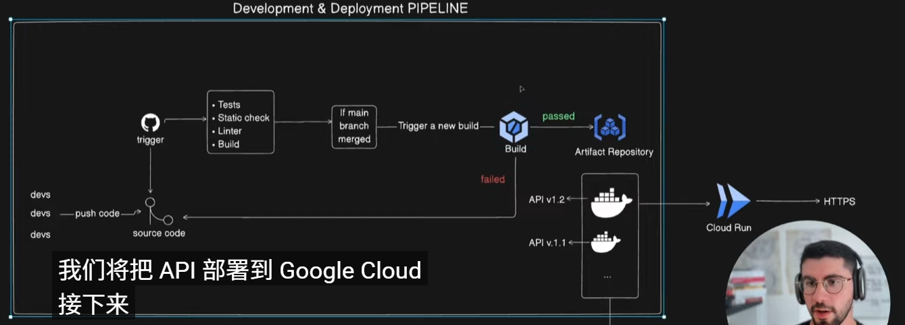

# go7 项目

## 调试go项目
go 推荐使用delve, 只需要下载delve:
```shell
go install github.com/xxxxxxx/delve@latest
```

有了delve，就可以直接在vscode中编写launch.json文件配置调试:
```json
{
    // 注意这里必须有configurations，不然vscode无法进行调试
    "configurations": [
        {
            "name": "Launch Server",
            "type": "go",
            "request": "launch",
            "mode": "debug",
            "program": "${workspaceFolder}/main.go",
            "args": [
            ]
        },
     
    ],
}

```



## 设计技术

- go
- docker
- postgress running on docker
- swagger for doc
- Golang migrate for migaration


## 参考资料

https://12factor.net/zh_cn/config